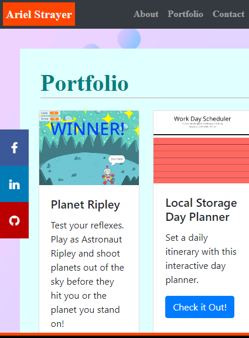

# responsive-portfolio-hw

This is my revised responsive portfolio homework. It was built using bootstrap's grid system, and links together three different pages - an about page, a portfolio page, and a contact page. This version includes links to my facebook, linkedin, and github pages, as well as a current copy of my resume. I've included my first class group project, and three other homework assignments I feel I did well at.

https://arielbs1991.github.io/responsive-portfolio-hw/
https://github.com/arielbs1991/responsive-portfolio-hw

