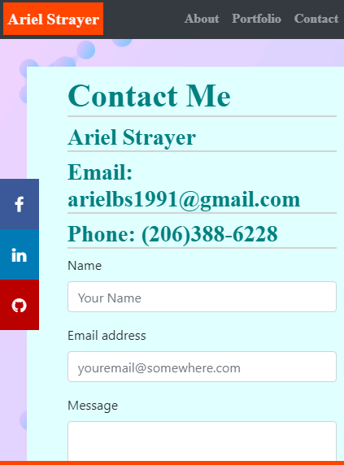

# responsive-portfolio-hw

This is a responsive portfolio project with three linked pages. An about me page, a portfolio page with links to projects, and a contact page. I used html, css, and got to practice bootstrap's grid system. 

